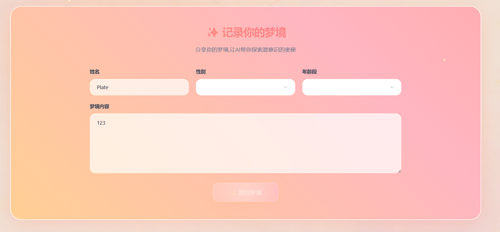

# MindDream心理梦境分析系统操作手册

## 一、相关文档

| 文档名称 | 指向资料 | 说明 |
| --- | --- | --- |
| 总体设计 | 《总体设计说明书》 | 说明软件整体架构、功能模块划分、页面组成和技术选型。 |
| 详细设计 | 《详细设计说明书》 | 说明各功能页面的组件构成、数据流、状态管理和接口交互细节。 |
| 测试案例 | 《测试案例》 | 记录各功能模块的测试场景、操作步骤、预期结果和异常处理。 |
| 数据库设计 | 《数据库设计文档》 | 说明梦境数据和统计数据的表结构、字段定义和关系映射。 |

以上文档与本操作手册共同构成 MindDream 心理梦境分析系统的完整软件文档体系。

## 二、说明

MindDream心理梦境分析系统是一套用于心理学梦境数据记录、统计分析与AI智能解读的Web应用软件。用户通过浏览器访问系统后，可以录入自己的梦境内容（包括梦境者基本信息与梦境报告文本），浏览和管理已录入的全部梦境记录，对梦境数据进行多条件检索，并通过交互式图表查看梦境数据的统计分布情况。

系统的核心价值在于将非结构化的梦境叙述文本转化为可量化、可分析的结构化数据——每条梦境都标注了情感类型、出现人物和年龄段等维度，用户可以从性别比例、年龄分布、情感趋势和角色频次等角度观察梦境数据的整体规律。系统还集成了AI分析能力：用户选择任意一条梦境后，可调用AI对该梦境进行综合解读，输出情感分析结果、梦境符号含义说明以及个性化洞察建议；同时提供AI对话功能，用户可直接输入心理学问题进行咨询。

本系统适用于三类使用场景：心理学研究者利用统计图表和数据检索功能进行梦境数据的批量分析；心理咨询师通过梦境详情和AI分析辅助了解来访者的梦境模式；普通用户记录个人梦境并进行自我探索。使用前用户只需确保浏览器为Chrome或Edge的最新版本，设备可通过网络访问系统部署地址即可，无需安装客户端软件。系统数据由管理员负责导入和维护。

## 三、功能特点

系统围绕梦境数据的完整生命周期提供七个核心功能模块，用户从首页开始即可完成从梦境录入到AI深度解读的全部操作。

**首页仪表板**是用户进入系统后的第一视图。页面自动加载并展示当前梦境数据的总览统计——梦境总数、梦境者人数、情感类型数和年龄组数，这四个指标以Bento Grid卡片布局呈现，大卡片显示梦境总数并附带进度条动画，中卡片显示梦境者数并附带动态柱状图，两个小卡片分别显示情感类型数和年龄组数。首页同时嵌入情感光谱柱状图和性别、年龄分布环形图，所有图表均基于ECharts渲染，支持鼠标悬停查看详细数值。页面中部设有一个梦境录入表单，包含姓名输入框、性别下拉选择、年龄段下拉选择和梦境内容文本输入区，用户填写完毕后点击提交按钮即可将新梦境存入系统。页面底部展示三条随机梦境摘要卡片，点击卡片可直接进入对应梦境的详情页。

**梦境列表**以卡片网格形式分页展示系统中的全部梦境记录，每页最多显示十二张卡片。每张卡片上显示梦境编号、性别标签（蓝色表示男性、粉色表示女性）、年龄段标签、梦境者姓名、梦境报告内容摘要（截取前一百四十字）、记录时间段和出生年份。列表上方设有筛选工具栏，用户可以按性别、年龄组和关键词三个条件单独或组合过滤数据。筛选结果实时反映在结果计数行中，无匹配时显示空状态提示图。列表底部提供分页控件，用户可点击页码或直接输入页码跳转。

**梦境详情**展示单条梦境的全部信息。页面采用左右分栏布局：左侧主区域显示梦境叙述卡片（含完整报告文本）和AI智能分析入口卡片；右侧边栏依次展示出现人物卡片（以标签形式列出该梦境中识别到的角色类型，中文名称）、情感色彩卡片（以标签形式列出该梦境的情感类型，中文名称）和原始编码卡片（展示人物和情感的英文原始编码数据，供研究人员核对）。页面左上角固定显示返回按钮，点击可回到上一页。

**高级搜索**提供独立的多条件组合检索能力。搜索条件分为三个区域：基础信息区包含性别和年龄组下拉选择，内容搜索区提供文本输入框用于关键词匹配梦境报告内容，时间筛选区提供文本输入框用于输入时间段关键词。用户设置好条件后点击搜索按钮，结果以卡片网格形式分页展示，每页最多九条。页面同时提供重置按钮，一键清空所有条件。

**数据统计**集中展示四个维度的统计分析图表：性别分布图显示男性和女性梦境者的数量比例，年龄分布图显示成人、儿童和老年三个年龄段的梦境数量分布，情感分布图显示各情感类型（如焦虑、喜悦、恐惧等）的出现频次排名，角色类型分布图显示梦境中常见人物角色（如家人、陌生人、同事等）的出现频率。全部图表基于ECharts渲染，支持鼠标悬停浮动显示具体数值和百分比。

**AI智能分析**对选定的单条梦境进行深度解读。用户从梦境详情页点击AI分析入口卡片进入后，系统首先展示梦境内容预览（可展开查看全文），下方列有情感分析、符号解读、个人洞察和行动建议四个功能标签。用户点击开始分析按钮后，系统通过后端AI接口处理梦境文本，分析完成后依次展示：置信度进度条（表示本次分析的可信程度）、总体分析摘要（整段心理学解读文字）、情感分析（主要情感标签和强度百分比、次要情感标签组）、符号解读列表（每个识别到的梦境符号配有含义说明和在该梦境中的情境解释）、个人洞察（针对该梦境者生成的个性化见解）和行动建议（关于改善睡眠和自我认知的实用指导）。

**AI对话**功能嵌入在AI分析页面底部。对话区顶部展示AI梦境顾问的标题和引导说明，历史对话以聊天气泡形式展示——用户问题气泡右对齐显示在粉色背景框中，AI回复气泡左对齐显示在白色磨砂背景框中，每条消息附有时间戳。输入区上方设有四个快捷提问按钮（为什么会做梦？/噩梦意味着什么？/如何更好地记住梦境？/梦境能预示未来吗？），点击即可自动填入问题。用户也可在底部输入框中自由输入问题，按回车或点击发送按钮提交。

## 四、系统要求

| 项目 | 最低配置 | 推荐配置 |
| --- | --- | --- |
| 操作系统 | Windows 10 或 macOS 11 | Windows 11 或 macOS 14 及以上 |
| 浏览器 | Chrome 90 或 Edge 90 | Chrome 120 及以上 或 Edge 120 及以上 |
| 屏幕分辨率 | 1366 × 768 | 1920 × 1080 及以上 |

本系统为B/S架构，用户端仅需浏览器即可访问全部功能。服务端运行环境需另行部署Java JDK 17及以上、MySQL 8.0及以上和Node.js 16及以上，普通用户无需关心服务端配置。

## 五、首页仪表板

系统首页是用户访问系统后的默认页面。页面打开后自动向服务端请求统计数据、图表数据和随机梦境数据，加载完成后各部分同时呈现。

页面最上方是标题区，显示"Dream Analytics Platform"徽章和"探索潜意识的奥秘"大标题，下方数字高亮当前梦境总数。紧接着是梦境录入表单区，标题为"记录你的梦境"。表单包含四个字段：姓名输入框（文本自由输入）、性别下拉选择（男/女）、年龄段下拉选择（儿童 0-12岁/成人 13-60岁/老年 60岁以上）和梦境内容文本框（多行输入，建议详细描述梦境经过）。四个字段均为必填，其中梦境内容至少需要输入十个字符。不满足填写要求时，底部的"提交梦境"按钮保持灰色禁用状态；全部填写完毕后按钮变为可点击的珊瑚粉渐变色。点击提交后，按钮切换为"提交中..."加载状态，系统将数据发送至服务端保存，成功后页面顶部弹出绿色提示条显示"梦境记录成功"，表单自动恢复为空白状态，同时上方的统计数字和图表均刷新为最新数值。如果提交失败（如网络中断或服务端异常），页面弹出红色错误提示条。

表单下方是统计卡片区域，采用四列Bento Grid网格布局。左侧大卡片占据两列两行，中央显示月球图标和梦境总数值（大号数字带渐变色），下方有一条渐变色进度条。中间卡片占据两列一行，显示人物群组图标和梦境者人数，下方有七根动态柱状图（高度随机模拟趋势）。右侧两个小卡片分别显示⚡图标配情感类型数量和🎯图标配年龄组数量。所有卡片表面有液态玻璃磨砂效果，鼠标悬停时卡片呈现3D透视旋转（跟随光标位置倾斜），并显示流动的光泽扫光动画。

卡片区域下方是情感光谱分析图（横条柱状图，展示前十种情感类型的频次排名）和两个环形图（性别比例和年龄比例），均使用ECharts渲染，支持鼠标悬停浮窗显示具体数值。页面最底部是"近期梦境"区域，以三列卡片展示三条随机选取的梦境摘要，每条显示两位数编号水印、梦境者姓名、报告内容前一百字摘要、性别和年龄标签，点击卡片跳转至梦境详情页。

*图1：首页仪表板全页截图，包含顶部标题区、梦境录入表单、Bento Grid统计卡片区域、ECharts图表区和近期梦境卡片区域。*

*图2：首页仪表板录入区，展示用户在表单中填写姓名、性别、年龄段和梦境内容后准备提交的操作状态。*

## 六、梦境列表

梦境列表页以卡片网格形式分页展示全部梦境记录。用户从首页导航菜单点击"梦境列表"进入，或直接访问/dreams路径。

页面顶部显示"梦境档案馆"徽章和"探索梦境——追寻潜意识的足迹"标题。下方的筛选工具栏以液态玻璃卡片为背景，从左到右依次排列：性别下拉框（可选全部/男性/女性）、年龄组下拉框（可选全部/成人/儿童/老年）、关键词搜索输入框和支持回车触发搜索的"搜索"按钮。所有筛选条件均为可选项，不选择任何条件时展示全部数据。

工具栏下方显示结果统计行，左侧文字为"共找到"，中间大号数字高亮匹配的梦境总数，右侧灰色提示"点击卡片查看详情"。梦境卡片以响应式网格排列（每行最多三张），每张卡片包含：顶部区域并排显示性别标签和年龄段标签以及右侧的梦境编号，中间显示梦境者姓名（大号加粗标题），下方为梦境报告内容摘要（最多一百四十字，超出截断以省略号结尾），底部左侧显示时间段和出生年份图标信息，右侧有一个"阅读"胶囊按钮。鼠标悬停时，卡片整体微微上浮并显示周围光晕（男性梦境为蓝色光晕，女性为粉色光晕），"阅读"按钮渐变为珊瑚粉渐变背景并向右微移。点击卡片任意位置跳转至对应梦境详情页。

如果筛选后无匹配记录，页面中央显示云朵图标和"暂无梦境数据——尝试调整筛选条件"的提示。数据加载过程中显示旋转加载动画。列表底部提供Element Plus分页控件（含上一页、页码按钮、下一页和页码跳转输入框），点击页码后页面滚动至顶部并刷新数据。

*图3：梦境列表页截图，包含筛选工具栏、结果计数行、梦境卡片网格和底部分页控件。*

## 七、梦境详情

梦境详情页展示单条梦境记录的完整信息。用户可从梦境列表、搜索结果或首页近期梦境卡片中点击任意梦境进入。

页面左上角固定显示"← 返回"按钮，点击后回到上一浏览位置。顶部为梦境Hero区，居中展示：性别标签（蓝色男/粉色女）、年龄段标签和时间段标签横向排列，下方显示梦境编号（如"#001"）和梦境者姓名（大号加粗），再下方为出生年份和"梦境报告"标识。

页面的主要内容采用左宽右窄的双列布局。左侧主区域从上到下依次为"梦境叙述"卡片和"AI智能分析"入口卡片。"梦境叙述"卡片内展示梦境报告的完整文本，以两端对齐、1.8倍行距排版，方便阅读。AI分析入口卡片采用暖色渐变背景，左侧为✨图标，中间显示"AI智能分析"标题和"深入解析这个梦境的象征意义"引导文字，右侧为箭头图标，鼠标悬停时卡片微微放大并向右偏移，点击后跳转至该梦境的AI分析页面。

右侧边栏固定吸附在页面上方（滚动时保持可见），包含三个信息卡片。第一个为"出现人物"卡片，标题处有👥图标，内容区以圆角标签形式列出该梦境中识别到的所有人物角色（以中文名称展示，如"家人""陌生人""同事"等）。第二个为"情感色彩"卡片，标题处有💭图标，内容区以暖色标签形式列出该梦境的情感类型（如"焦虑""喜悦""恐惧"）。第三个为"原始编码"卡片，标题处有🔍图标，内容区以灰色代码块形式分别展示人物英文编码（characters_raw字段）和情感英文编码（emotions_raw字段），供专业研究者对照使用。页面加载时显示加载动画，数据加载失败时页面无内容展示，用户需返回重试。

*图4：梦境详情页全页截图，包含左侧梦境叙述区、AI分析入口卡片、右侧人物标签、情感标签和原始编码卡片。*

## 八、高级搜索

高级搜索页提供独立的多条件组合检索功能。用户从导航菜单点击"高级搜索"进入，或直接访问/search路径。

页面顶部居中显示🔍浮动搜索图标（带上下浮动动画和光晕脉冲效果）以及"高级搜索——通过多维度条件精确查找梦境"标题。搜索表单以液态玻璃卡片承载，分为三个筛选区域。第一个为"基础信息"区（👤图标），包含性别下拉框和年龄组下拉框，两个选择框并排显示。第二个为"内容搜索"区（📝图标），包含一个多行文本输入框，用于输入关键词匹配梦境报告正文内容。第三个为"时间筛选"区（⏰图标），包含一个单行文本输入框，用于输入时间段关键词（如"夜晚""清晨"）。三个区域之间以浅色分割线隔开。

表单底部居中排列两个操作按钮：左侧"🔄 重置"按钮为透明幽灵按钮，点击后清空所有筛选条件并隐藏搜索结果；右侧"搜索梦境"按钮为渐变色主按钮，点击后向服务端发送搜索请求。搜索执行后，表单下方显示"搜索结果"标题和"找到 N 个梦境"的计数，匹配的梦境以三列卡片网格展示，每张卡片结构同梦境列表页一致（顶部彩色装饰条、性别和年龄标签、姓名、内容摘要、时间段和"查看"胶囊按钮）。搜索结果支持分页浏览，每页最多九条。无匹配时显示月球空状态图标和"未找到匹配的梦境——尝试调整搜索条件"提示。点击任意搜索结果卡片跳转至对应梦境详情页。

*图5：高级搜索页截图，包含搜索表单三个筛选区域、操作按钮和搜索结果卡片区域。*

## 九、数据统计

数据统计页以交互式ECharts图表展示梦境数据的统计分析结果。用户从导航菜单点击"数据统计"进入，或直接访问/statistics路径。

页面顶部居中显示"数据洞察"徽章和"梦境数据统计"大标题。页面主体按图表类型排列：上方为性别分布环形图（内环实心、外环镂空，珊瑚粉代表女性、珊瑚金代表男性，中央空白），下方左侧为年龄分布饼图（三种颜色分别对应成人/儿童/老年），右侧为情感分布柱状图（横轴为情感名称、纵轴为数量，柱子使用珊瑚粉到金黄的纵向渐变），再下方为角色类型分布图（展示常见角色类型的频次排名）。所有图表在页面加载时自动从服务端获取数据并渲染，渲染过程中使用渐变色和过渡动画效果。

用户将鼠标悬停在任意图表的数据扇区、柱子或数据点上时，ECharts自动弹出浮动提示框显示该数据项的名称、具体数值和占比百分比。图表支持浏览器的窗口大小自适应——用户缩放浏览器窗口时图表自动调整尺寸。页面数据加载期间显示环形旋转加载动画。

*图6：数据统计页上半部截图，展示性别分布环形图和年龄分布饼图。*

*图7：数据统计页下半部截图，展示情感分布柱状图和角色类型分布图。*

## 十、AI梦境智能分析

AI梦境智能分析页对选定的梦境进行深度AI解读。用户从梦境详情页点击"AI智能分析"入口卡片进入，或直接访问/dreams/:id/analyze路径。

页面顶部显示"🤖 AI 梦境顾问"徽章（带脉冲动画小圆点）和"智能梦境分析"大标题，下方副标题为"运用人工智能深度解读梦境的象征意义与潜意识信息"。页面首先展示梦境内容预览卡片——用户可以看到该梦境报告的前两百字摘要，点击"展开全文"按钮可查看完整报告文本。预览下方是引导操作区：中央显示✨大图标和"开启 AI 梦境解析"标题，下方列有"情感分析""符号解读""个人洞察""行动建议"四个功能标签，再下方是"🌙 开始分析"大按钮。点击该按钮后，按钮切换为"✨ 分析中..."加载状态，系统向服务端AI分析接口发送请求，传递梦境ID、报告文本、人物数据和情感数据。

分析完成后，页面展示结构化的分析结果。最上方是置信度卡片（暖黄渐变背景），左侧显示🎯图标和"分析置信度"文字，右侧为渐变色进度条和百分比数字（动画过渡）。接下来依次排列五个结果卡片：第一个为"总体分析"卡片（📋图标），展示整段心理学综合解读摘要文字。第二个为"情感分析"卡片（💭图标），上方展示主要情感标签和情感强度百分比进度条，中间展示次要情感标签组，下方为文字说明段落。第三个为"符号解读"卡片（🔮图标），逐条列出识别到的梦境符号，每条包含符号名称（粗体带渐变圆点）、含义说明文段、以及在该梦境中的情境解释（灰色小字）。第四个和第五个卡片以双列并排展示："个人洞察"卡片（💡图标）列出针对该梦境者的个性化分析见解；"行动建议"卡片（🌿图标）列出关于改善睡眠质量与增强自我认知的实用建议。两个卡片内的条目均以左侧彩色细线和暖色背景块的列表形式展示。如果分析请求失败（如网络异常或AI服务不可用），页面弹出红色错误提示"分析失败，请稍后重试"。

*图8：AI智能分析结果页截图，包含置信度进度条、总体分析卡片、情感分析卡片、符号解读列表、个人洞察和行动建议双列卡片区域。*

## 十一、AI对话

AI对话功能嵌入在AI分析页面底部，为用户提供梦境主题的问答交互。用户在AI分析页面向下滚动至对话区即可使用。

对话区顶部以分隔线区隔，上方为标题区：左侧💬图标，右侧显示"AI 梦境顾问"标题和"有关于梦境的疑问？问问 AI 顾问吧！"引导文字。标题下方为对话历史区域（最大高度四百二十像素，超出可滚动），初始状态显示🌙图标和"开始你的梦境探索之旅吧"的引导提示。用户发送问题后，消息以聊天气泡形式呈现：用户问题右对齐显示在带珊瑚粉渐变背景和圆角边框的气泡中，AI回复左对齐显示在白色磨砂半透明背景和阴影边框的气泡中，每条气泡下方标注发送时间（时:分格式）。新消息到达时对话区域自动滚动到底部。

对话历史上方设有一行快捷提问按钮，以暖色背景圆角按钮排列四个预设问题：为什么会做梦？/噩梦意味着什么？/如何更好地记住梦境？/梦境能预示未来吗？。用户点击任一按钮，问题自动填入底部输入框。用户也可在底部输入框中直接输入自己的问题（支持中文自由文本），按回车键或点击右侧渐变色"发送 →"按钮提交。提交后按钮切换为"思考中..."加载状态，AI回复返回后按钮恢复正常。如果对话请求失败，页面弹出"对话失败，请稍后重试"提示。

*图9：AI对话区截图，展示对话历史气泡、快捷提问按钮行和底部输入框与发送按钮区域。*

## 十二、常见问题解答

**问：为什么提交梦境后看不到数据更新？**

答：提交成功后页面会自动刷新统计数据。如果数据未更新，请先检查网络连接是否正常，然后刷新浏览器页面后重试。如果问题仍然存在，请联系系统管理员确认后端服务是否正常运行以及数据库连接是否正常。

**问：如何在大量梦境中快速找到某一条记录？**

答：可以使用两种方式。第一种是在梦境列表页顶部筛选工具栏中按性别、年龄组和关键词快速过滤；第二种是进入高级搜索页面，按性别、年龄组、关键词和时间段进行多条件组合精确检索。两种方式均支持搜索结果分页浏览。

**问：AI分析的置信度是什么含义？**

答：置信度是AI对本次分析结果可信程度的自我评估，以百分比表示。百分比越高表示AI认为分析结果越可靠。由于梦境解读本身具有一定的主观性，建议用户在参考AI分析结论时结合自身的实际感受和生活背景进行综合判断。

**问：梦境内容会被其他人看到吗？**

答：当前版本下，所有梦境数据对通过浏览器访问系统的用户均可见，这一设计适用于团队研究场景下的数据共享。如果需要在个人隐私场景下使用，建议在部署时增加用户账户和权限隔离机制。

**问：支持哪些浏览器访问？**

答：推荐使用Google Chrome或Microsoft Edge浏览器的最新版本。基于Chromium内核的其他浏览器（如360浏览器的极速模式）通常也能正常使用。不建议使用Internet Explorer等老旧浏览器，可能出现页面样式错乱或功能异常。

**问：统计图表中的数据可以导出吗？**

答：当前版本支持在图表上鼠标悬停查看详细数值和占比，暂不提供图表图片或数据文件的一键导出功能。如需保存图表，可使用浏览器截图工具或操作系统的截图功能截取图表区域。

## 十三、术语表

| 术语 | 解释 |
| --- | --- |
| 梦境报告 | 用户在系统中录入的梦境内容文本，描述梦中的场景、人物、事件和个人感受，是AI分析和统计的核心数据来源。 |
| 情感色彩 | 对梦境中体现的情绪状态进行分类标注，系统支持多种情感类型（如焦虑、喜悦、恐惧、悲伤、愤怒、惊讶等），用于统计分析和情感趋势判断。 |
| 符号解读 | AI分析功能的一个子模块，自动识别梦境文本中的心理学符号（如"家"代表安全感或自我、"水"代表情绪状态、"门"代表选择或过渡等），并给出符号在心理学中的常见含义以及在该梦境具体情境下的解释。 |
| 年龄段 | 对梦境者的年龄进行分类，系统划分为三组：儿童（0-12岁）、成人（13-60岁）和老年（60岁以上）。年龄段用于统计分析和搜索筛选。 |
| 出现人物 | 从梦境报告中识别出的人物角色类型，以中英文两种编码存储——中文名称用于页面展示（如"家人""陌生人""同事"），英文原始编码用于数据研究。 |
